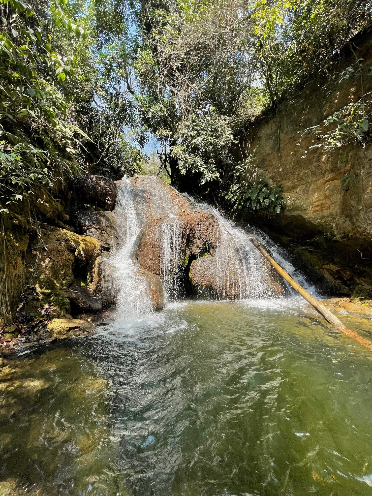
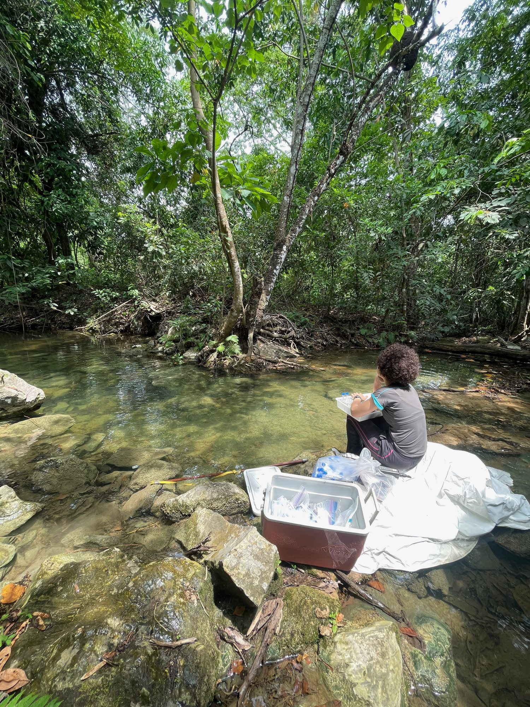
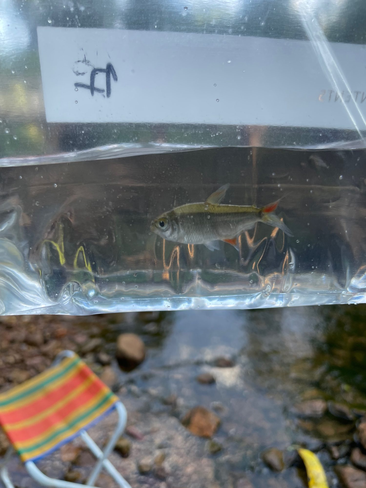
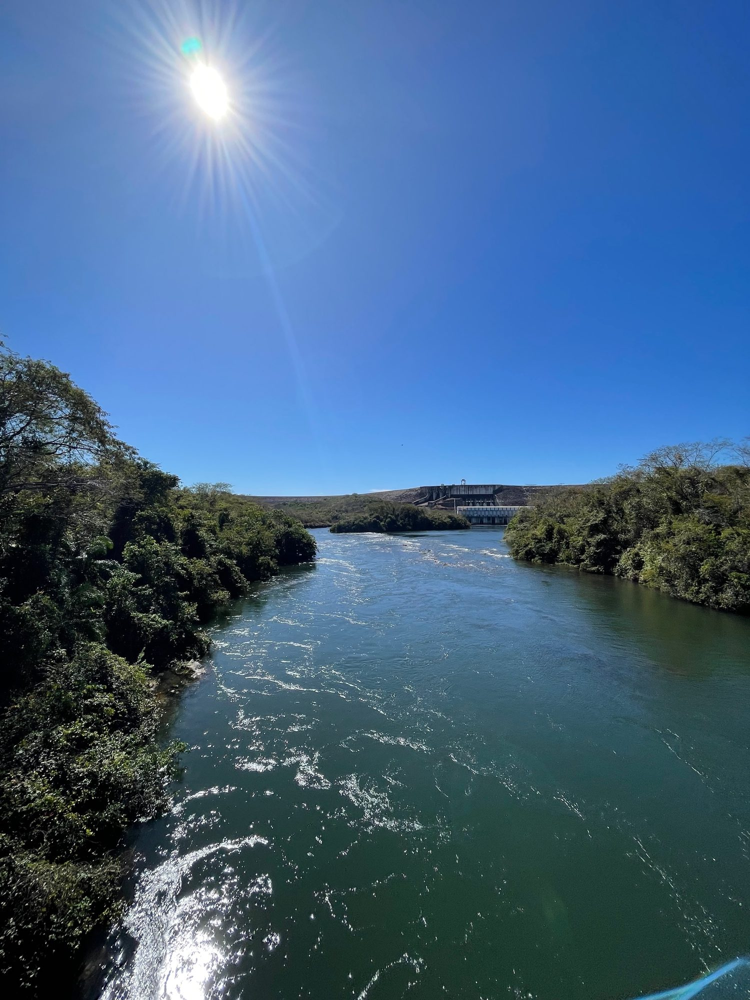
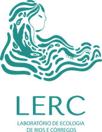
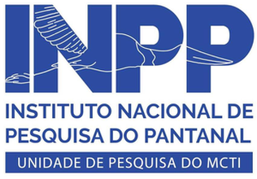
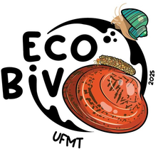

<!-- PENDENTE (nota interna, não aparece na página):
Ditar, para cada projeto: pergunta, o que é medido, como, onde, período,
financiamento e colaboradores. Os textos abaixo vieram do esqueleto e
descrevem o seu trabalho de forma aproximada -- precisam da sua redação.
-->

## Current projects

### Ecosystem metabolism in travertine-depositing streams

{.side-figure}

Travertine streams deposit CaCO~3~ as they degas CO~2~, but the same water is simultaneously worked on by photosynthesis and respiration, which draw down and release dissolved inorganic carbon and shift pH. Biological and geochemical control of carbonate chemistry are therefore entangled: a dissolved-oxygen or pH record carries both signals at once. How much of the carbonate signal metabolism actually accounts for remains open, and almost unexamined in tropical streams with high biodiversity. The answer bears on a larger question: what fraction of riverine CO~2~ emission is metabolic rather than geochemical.

<!-- TODO: reescrever nas suas palavras. Confirmar: sítios, período de
     campo, variáveis medidas, quem colabora. Manuscrito em revisão:
     JGR-Biogeosciences 2025JG009333. -->

[Stream metabolism]{.tag} [Carbonate chemistry]{.tag} [High-frequency sensors]{.tag}

### Nutrient uptake and transient storage

{.side-figure-left}

Phosphorus co-precipitates with CaCO~3~, so travertine streams tend to be P-limited and the limitation is in part self-inflicted: the calcite that photosynthesis helps precipitate scavenges the phosphorus the same community depends on. Whether that feedback acts as a constraint or an opportunity for stream organisms is the question driving this project. We are measuring how much nitrogen and phosphorus these streams retain, and how biological and geochemical processes interact to set nutrient availability, using paired conservative-tracer and nutrient slug additions across a gradient of karst influence. Deconvolving the breakthrough curves separates uptake from transport, yielding nutrient assimilation and partitioning retention between the main channel and hyporheic zone.
 
<!-- TODO: reescrever. Confirmar: "TASCC" descreve o seu método ou sai?
     Nutrientes usados, número de adições, sítios, estado do capítulo. -->

[Solute transport]{.tag} [Nutrient uptake]{.tag}
 
### Measuring the role of organisms in modulating ecosystem functioning

{.side-figure}

Karst headwater streams in the Cerrado–Pantanal ecotone hold on the order of 350 fish species, often in dense aggregations. In these oligotrophic ecosystems, animal excretion can be a meaningful supply of dissolved nitrogen and phosphorus, and the amount supplied and its N:P ratio depend on the biomass, functional traits and taxonomic composition of the assemblage. Because excreta are released in dissolved and particulate forms with different stoichiometry, consumers can fuel autotrophic and heterotrophic pathways unequally, shifting the balance between primary production and respiration. That shift reaches back into the carbonate system: by altering CO~2~ demand, pH and carbonate saturation, consumer aggregations may regulate travertine formation from the top of the food web.

### Aquatic biomonitoring (consultancy)

{.side-figure-left}

Since 2022 I have worked as an environmental consultant at LED Consultoria Ambiental, designing and running hydrochemical and biological monitoring programmes for impact assessment and environmental licensing in Pará and in Atlantic Forest–Cerrado rivers. The work runs from field campaigns under QA/QC and sample-traceability protocols, through the analysis of phytoplankton, zooplankton, benthic macroinvertebrate and fish data, to the hydrochemical and biological indicators that describe the condition of a freshwater system for the regulator. The deliverable is a report; the product is a versioned, re-runnable pipeline in R that validates the raw laboratory spreadsheets, builds the figures and carries them through to the client's final format, keeping inconsistencies and regulatory non-compliance out of the document.

<!-- TODO: confirmar o que pode ser dito publicamente sobre clientes,
     contratos e setor. -->

[Benthic macroinvertebrates]{.tag} [Water quality]{.tag} [Reporting pipelines]{.tag}

## Study sites



<!-- TODO: se quiser um mapa por trecho (CB, CC, CD, RA, RC, RT, SR),
     preencher data/sites.csv; o chunk correspondente está arquivado em
     _models-draft.qmd. -->

## Research groups

**LERC, Stream Ecology Lab, Universidade do Estado do Rio de Janeiro.** Led by
Dr. Eugenia Zandonà, Dr. Vinicius Neres-Lima, and Dr. Timothy P. Moulton. It is
where my doctoral work was done and where I am currently a postdoctoral
researcher.

**Instituto Nacional de Pesquisa do Pantanal (INPP).** Associate fellow under
a CNPq PCI-DB fellowship, in the Wetland and Ecosystem Ecology line, working on
biodiversity monitoring of wetland vertebrates.

**[Ecosystem Stoichiometry Lab](https://ecostoich.weebly.com/), University of
Nebraska--Lincoln, and the Stoich Project.** Collaboration with Dr. Jessica
Corman on travertine streams in Arizona, New Mexico and Mato Grosso, including
fieldwork in the United States during a CAPES-PrInt fellowship, and on other
studies in ecological stoichiometry.

**EcoBiv, Universidade Federal de Mato Grosso.** Laboratório de Ecologia e
Conservação de Bivalves, led by Dr. Rogério dos Santos, on freshwater mussel
ecology. It is also where I co-mentored undergraduate students.

::: {.logo-row}

:::

<!-- TODO: URL do LERC quando existir; logo do Ecosystem Stoichiometry Lab
     (images/logos/unl.png) se você conseguir uma versão em PNG. -->
