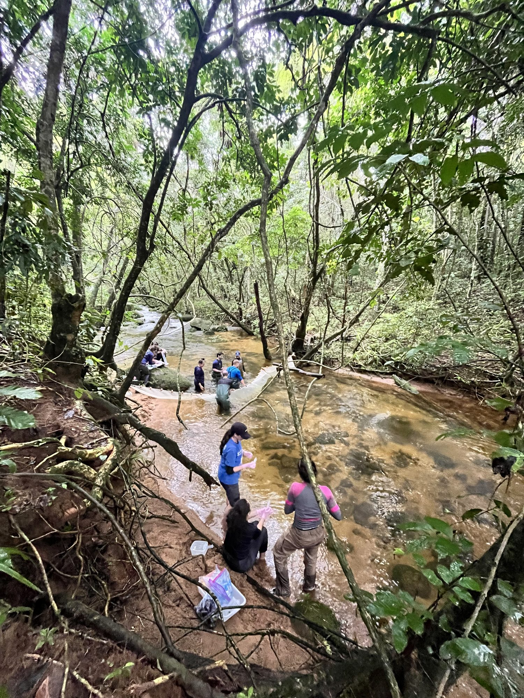
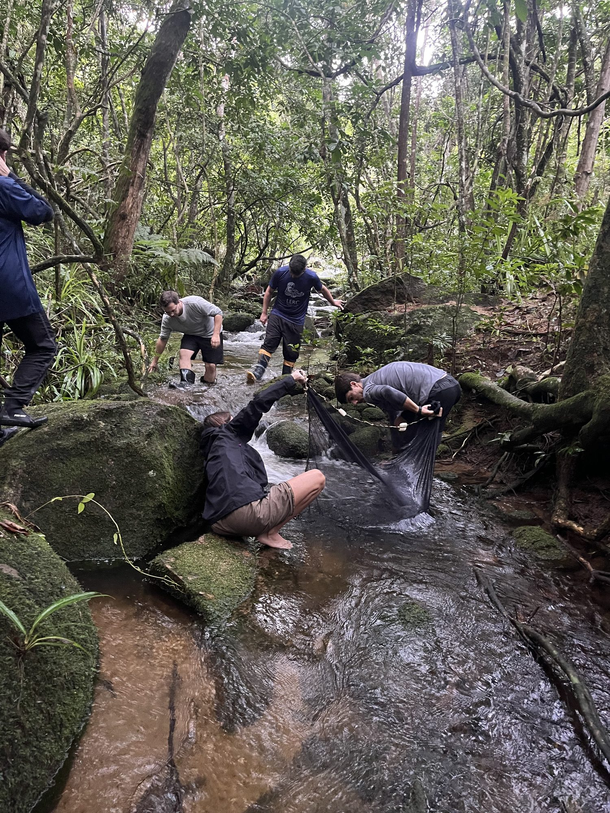

## Courses

### Stream ecology --- graduate course, Ilha Grande, 2026

{.side-figure}

Invited lecturer on a graduate field course in stream and river ecology, for
MSc and PhD students, held on Ilha Grande, Rio de Janeiro. Classes run both in the
room and in the streams themselves: students measure, sample and argue about
what the numbers mean while standing in the water.

{.side-figure-left}

<!-- TODO: instituição e programa de pós-graduação responsáveis, carga horária,
     e o nome da disciplina em português se quiser mantê-lo ao lado. -->

### Theoretical and Applied Ecology --- UERJ, 2023

Teaching assistant on an undergraduate course covering population, community
and ecosystem ecology, with the practical sessions built around data analysis
in R.

## Mentorship

Between 2022 and 2025 I supervised three undergraduate students at the
Universidade Federal de Mato Grosso on projects in freshwater mussel ecology
and ecosystem ecology. Two of those projects were presented as first-authored
posters at conferences. Names and dates are in the [CV](cv.qmd).

## Outreach

- **2024** --- Educator at a workshop and public event of Sesc Pantanal, on
  water quality and the role of biodiversity in Cerrado and Pantanal streams.
- **2023** --- Educator at the *Enduro a Pé* event, Parque Sesc Serra Azul, on
  stream and river ecology and biodiversity.
- **2023** --- Interactive workshops on freshwater ecology and stream
  conservation for public-school students in Rio de Janeiro.
- **2022** --- Volunteer educator with public-school students in Rio de
  Janeiro: hands-on activities on stream ecosystems and aquatic biodiversity.

## Teaching material

<!-- TODO: roteiros de aula, tutoriais de R, dados de exemplo. Pode virar um
     repositório no GitHub linkado daqui. Cortar a seção se não houver. -->
